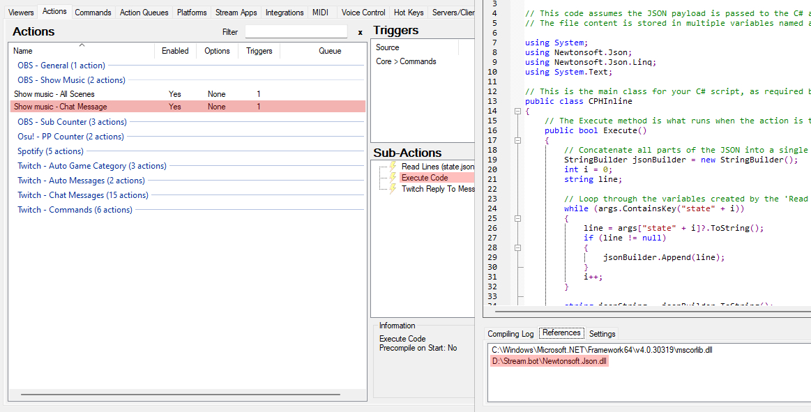
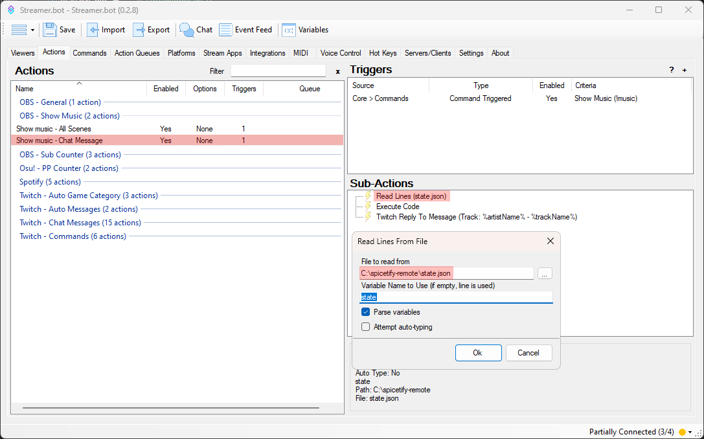

# spicetify-remote

A spicetify extension for remote control/viewing info using websockets.

**The code was made entirely with AI so, don't ask me for any kind of help with the code because i don't know much about coding, BUT it all should just work out of the box now.**

## Table of Contents

- [Features](#features)

- [Requirements](#requirements)

- [Installation](#installation)

- [Usage](#usage)

- [Adding the server as a service in Windows (optional)](#adding-the-server-as-a-service-in-windows-optional)

- [Adding Streamer.bot commands (optional)](#adding-streamerbot-commands-optional)

## Features

- Remote control from a website or using websockets

- Remote viewing from a website

- Built in OBS Widget for streamers

## Requirements

- git

## Installation

1. Clone the Repo and navigate to the directory:

```bash
git clone https://github.com/dekub100/spicetify-remote
cd spicetify-remote
```

2. Run the automated setup script for your operating system:

- **For Windows:** Run `setup.bat` as an **administrator**.

- **For Linux/macOS:** Run `setup.sh` as a regular user.

These scripts will tell you if there's any dependencies missing and configure the extension automatically.

## Usage

1. Test if everything has installed correctly by running the server:

```bash
node volume-server.js
```

2. If there are no errors, open up [http://localhost:8888](http://localhost:8888) or http://localhost:8888/obs

## Adding the server as a service in Windows (optional)

Instead of manually installing the service, you can now use the provided automated scripts.

1. **Install the service:**
   Run `install-service.bat`. This script will automatically download and set up the service for you.

2. **Remove the service:**
   Run `remove-service.bat`. This script will automatically remove the service for you. You will need to stop it beforehand.

## Adding Streamer.bot commands (optional)

1. Open up streamerbot/streamerbot.txt and copy the contents into the 'Import' feature in Streamer.bot

2. **Update file paths in 'Show Music - Chat Message' Action (Important):**
   - Newtonsoft.Json.dll: In the 'Execute Code' sub-action references, update the path for Newtonsoft.Json.dll. The current path is D:\Stream.bot\Newtonsoft.Json.dll. Change this to the location of the file in your Streamer.bot installation folder. (Image 1)
   - state.json: In the 'Read Lines (state.json)' Sub-Action, update the path for the state.json file. The current path is C:\spicetify-remote\state.json. Change this to the location of the file in your spicetify-remote folder. (Image 2)

<div style="display: flex; gap: 10px;">
    
    
</div><br>

3. Test out the commands in twitch chat:

- !music
- !sstop
- !splay
- !snext
- !sprev
- !vol 0-100 / !vol 0-1.0
